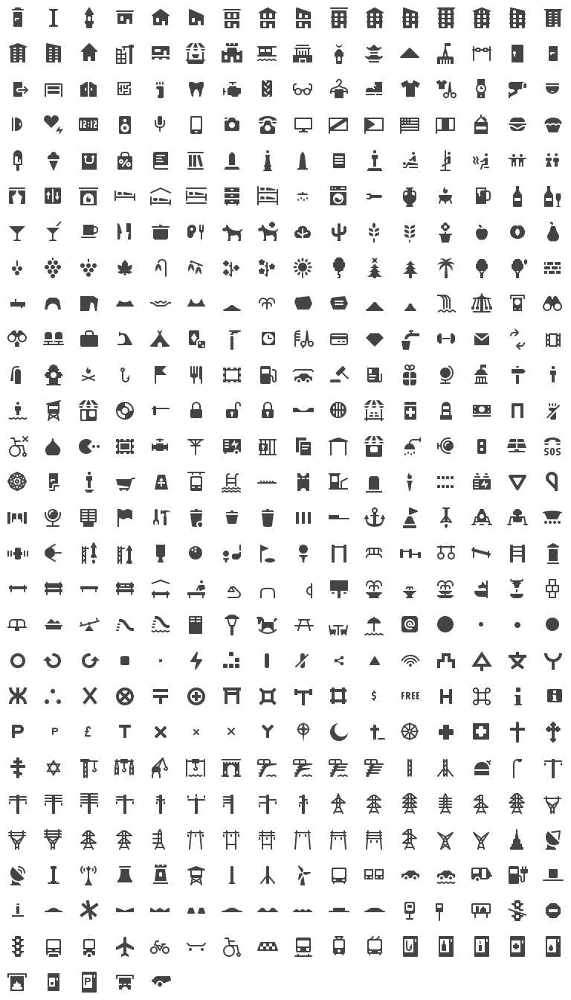

# Röntgen

Röntgen is a set of monochrome 14 × 14 px pixel-aligned icons. All icons are
under the [CC BY](http://creativecommons.org/licenses/by/4.0/) license. So, do
whatever you want but please give the appropriate credit. 

Röntgen was created for [Map Machine](http://github.com/enzet/map-machine)
project to represent different map features from the OpenStreetMap database.
However, it can be easily used for any map project or even for not map-related
projects. Also, some icons can be used as emoji symbols.

All icons tend to support a common design style, which is heavily inspired by
[Maki](https://github.com/mapbox/maki),
[Osmic](https://github.com/gmgeo/osmic), and
[Temaki](https://github.com/ideditor/temaki).

Feel free to request new icons via issues on GitHub.